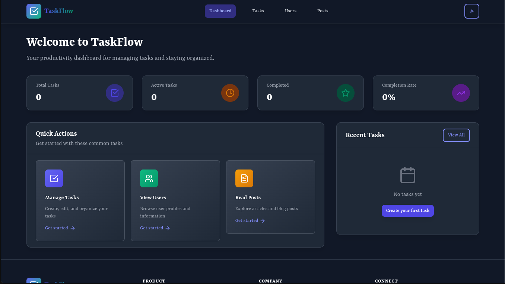

# TaskFlow


## 🛠️ Prerequisites

Make sure you have the following installed:

* [Node.js](https://nodejs.org/) (v16 or later recommended)
* [Git](https://git-scm.com/)
* [npm](https://www.npmjs.com/) or [yarn](https://yarnpkg.com/)

## 🚀 Getting Started

### 1. Clone the repository

```bash
git clone https://github.com/PLP-MERN-Stack-Development/week-3-react-js-assignment-quiesscent
cd your-repo-name
```

### 2. Install dependencies

Using npm:

```bash
npm install
```

Or using yarn:

```bash
yarn install
```

### 3. Start the development server

Using npm:

```bash
npm run dev
```

Or using yarn:

```bash
yarn dev
```

### 4. Open in Browser

The app will typically run at:

```
http://localhost:5173/
```

## 📦 Build for production

Using npm:

```bash
npm run build
```

Or using yarn:

```bash
yarn build
```

### Preview production build locally

```bash
npm run preview
```

Or:

```bash
yarn preview
```

## 🧪 Testing (optional, if configured)

```bash
npm run test
```


## 🧩 Tech Stack

* React
* Vite
* JavaScript or TypeScript (depending on setup)

## 📄 License

This project is licensed under the [MIT License](LICENSE).

## 🙌 Acknowledgements

Built with ❤️ using Vite + React.

---

For any issues, feel free to open a GitHub issue or contact the maintainer.


# Project Image




# Project Link

```
https://week3-delta.vercel.app/

```